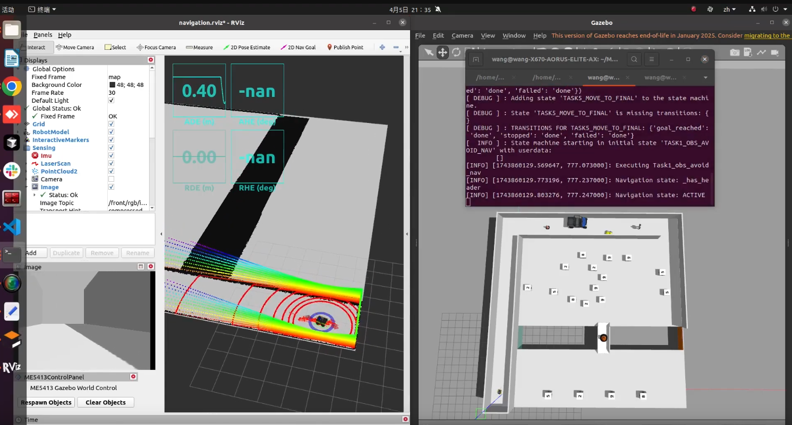

# RL Navigation


## Click below for video
[](https://www.youtube.com/watch?v=4XAWQVB_mV8)

## Dependencies

* System Requirements:
  * Ubuntu 20.04
  * ROS Noetic
  * C++11 and above
  * CMake: 3.0.2 and above
  * PyTorch
  * Tensorboard
  
* Standard ROS packages:
  * `roscpp`, `rospy`, `rviz`, `std_msgs`, `nav_msgs`, `geometry_msgs`, `visualization_msgs`, `tf2`, `tf2_ros`, `tf2_geometry_msgs`, `pluginlib`, `map_server`, `gazebo_ros`, `jsk_rviz_plugins`
  * `jackal_gazebo`, `jackal_navigation`, `velodyne_simulator`, `teleop_twist_keyboard`
* External Models:
  * [Gazebo official models](https://github.com/osrf/gazebo_models)


## Installation

This repo is a ROS workspace with three packages:

- `interactive_tools`
- `jackal_description`
- `me5413_world`

```bash
# Clone your own fork of this repo
cd ~
git clone https://github.com/<YOUR_GITHUB_USERNAME>/RL-Navigation.git
cd RL-Navigation

# Install all dependencies
rosdep install --from-paths src --ignore-src -r -y

# Source your workspace
source devel/setup.bash
```


### Prepare Gazebo Models

```bash
# Official models
cd ~
mkdir -p .gazebo/models
git clone https://github.com/osrf/gazebo_models.git
cp -r ~/gazebo_models/* ~/.gazebo/models

# Custom models
cp -r ~/ME5413_Final_Project/src/me5413_world/models/* ~/.gazebo/models
```

## Usage

### 0. Gazebo World

```bash
roslaunch me5413_world rl_world.launch
```

### 1. Training

```bash
rosrun me5413_world training.py
```


## Contribution

We welcome contributions via pull requests.  
Follow these style guides:

- [Google C++ Style Guide](https://google.github.io/styleguide/cppguide.html)
- [C++ Core Guidelines](https://isocpp.github.io/CppCoreGuidelines/CppCoreGuidelines#main)
- [ROS C++ Style Guide](http://wiki.ros.org/CppStyleGuide)

## License

This project is released under the [MIT License](https://github.com/NUS-Advanced-Robotics-Centre/ME5413_Final_Project/blob/main/LICENSE)
